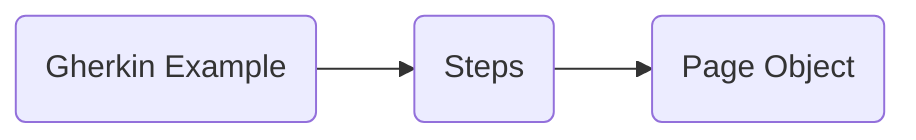

<<<<<<< HEAD

=======
>>>>>>> 7e93dda0505c758c969b835826ef5f306be87348
# Welcome to BDD with Cypress and Cucumber!
## Installation
`npm install `

That's all you need to install!

## Integration
Folder Structure
Integration
|
|---->featureFolder
					|---->codeIntegrationFolder
					|			|---->pageObject.js
					|			|---->stepsIntegration.js
					|
					|---->featureName.feature

## Fixtures
## Commands Folder
<<<<<<< HEAD
=======

>>>>>>> 7e93dda0505c758c969b835826ef5f306be87348

|userMail                        |userPassword              |
|-------------------------------|---------------------------|
|         'UserMail1'           |'UserPassword1'            |
|         'UserMail2'           |"UserPassword2"            |

You only have to change the "fake" usersMail and Pass with your own login data!

### Basic Flow

