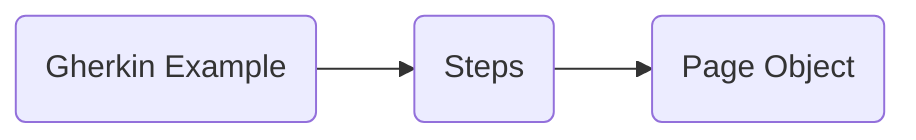

# Welcome to BDD with Cypress and Cucumber!
Tutorial to start to implement E2E with Cucumber and Cypress and don't die trying it.
## Let's do start!: Installation
`npm install `

That's all you need to install!

### Dependencies
"cypress": " [https://www.cypress.io/](https://www.cypress.io/)

"mocha": "[https://mochajs.org/](https://mochajs.org/)

"mochawesome": " [https://www.npmjs.com/package/mochawesome](https://www.npmjs.com/package/mochawesome)

"mochawesome-merge": " [https://www.npmjs.com/package/mochawesome-merge](https://www.npmjs.com/package/mochawesome-merge)

"mochawesome-report-generator": "[https://www.npmjs.com/package/mochawesome-report-generator](https://www.npmjs.com/package/mochawesome-report-generator)

# How it Works?
### Console commands to launch
`npm run test` => Launch cypress Test on "headless" mode

`npm run open` => Open the Cypress interface to launch Test manually

`npm run report` => Unifies the generated reports generated
## Integration
The integration folder has the biggest part of our code, you 'll create as many folder as Features you want to test.
Inside of each **feature folder** you'll create a code integration folder and a feature when you'll define the behaviour of the test.
Folder Structure

## Fixtures
## Commands Folder

|userMail                        |userPassword              |
|-------------------------------|---------------------------|
|         'UserMail1'           |'UserPassword1'            |
|         'UserMail2'           |"UserPassword2"            |

You only have to change the "fake" usersMail and Pass with your own login data!

### Basic Flow

