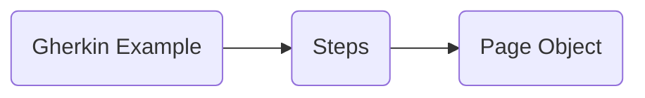

<<<<<<< HEAD

# Welcome to BDD with Cypress and Cucumber!
## Installation
`npm install `

That's all you need to install!

## Integration
## Fixtures
## Commands Folder
=======
# Welcome to BDD with Cypress and Cucumber!
## Integration
## Fixtures
## Commands
>>>>>>> b3d7aa591a2ee727d72f7bd38bb566bbbe0b6c4e

|userMail                        |userPassword              |
|-------------------------------|---------------------------|
|         'UserMail1'           |'UserPassword1'            |
|         'UserMail2'           |"UserPassword2"            |

You only have to change the "fake" usersMail and Pass with your own login data!

### Basic Flow
