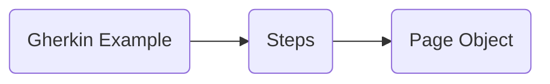

# Welcome to BDD with Cypress and Cucumber!
## Integration
## Fixtures
## Commands

|userMail                        |userPassword              |
|-------------------------------|---------------------------|
|         'UserMail1'           |'UserPassword1'            |
|         'UserMail2'           |"UserPassword2"            |

You only have to change the "fake" usersMail and Pass with your own login data!

### Basic Flow
